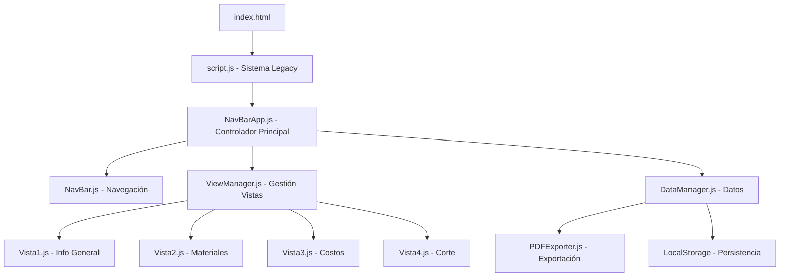

# 🎭 Generador de Ficha Técnica de Producción

[](https://github.com/ClaudioVilas/Generador-de-Ficha-Tecnica)
[](LICENSE)
[](https://developer.mozilla.org/en-US/docs/Web/JavaScript)
[](https://developer.mozilla.org/en-US/docs/Web/HTML)
[](https://developer.mozilla.org/en-US/docs/Web/CSS)

## � Descripción

**Generador de Ficha Técnica de Producción** es una aplicación web profesional para la creación, gestión y exportación de fichas técnicas detalladas para producciones teatrales, cinematográficas y eventos. La aplicación integra dos sistemas complementarios: un **sistema legacy** robusto y un **sistema NavBar moderno** con arquitectura de componentes.

### ✨ Características Principales

- 🎨 **Gestión completa de vestuario** con imágenes y especificaciones detalladas
- 📊 **Gestión de materiales** con colores, cantidades y proveedores
- 💰 **Control de costos** con cálculos automáticos y presupuestos
- ✂️ **Planificación de corte** con tiempos y recursos
- 📄 **Exportación a PDF** de alta calidad con formato profesional
- 💾 **Persistencia de datos** con guardado automático y manual
- 🔄 **Sincronización en tiempo real** entre vistas
- 📱 **Interfaz responsiva** adaptable a diferentes dispositivos

## 🏗️ Arquitectura del Sistema

El proyecto implementa una **arquitectura dual** que combina un sistema legacy estable con un sistema moderno de componentes:

```
📁 Generador-de-Ficha-Tecnica/
├── 🌐 Sistema Legacy (Base HTML/CSS/JS)
│   ├── index.html          # Página principal
│   ├── script.js           # Controlador legacy
│   └── style.css           # Estilos base
│
├── 🚀 Sistema NavBar Moderno (Componentes)
│   ├── src/
│   │   ├── NavBarApp.js    # Controlador principal
│   │   ├── navbar-styles.css # Estilos del NavBar
│   │   ├── components/
│   │   │   ├── NavBar.js      # Navegación
│   │   │   └── ViewManager.js # Gestor de vistas
│   │   ├── views/
│   │   │   ├── Vista1.js      # Información general
│   │   │   ├── Vista2.js      # Materiales
│   │   │   ├── Vista3.js      # Costos
│   │   │   └── Vista4.js      # Planificación corte
│   │   └── utils/
│   │       ├── DataManager.js  # Gestión de datos
│   │       └── PDFExporter.js  # Exportación PDF
│
└── 📚 Librerías Externas
    ├── jsPDF v2.5.1         # Generación de PDF
    ├── html2canvas v1.4.1   # Captura de pantalla
    └── Font Awesome v6.4.0  # Iconografía
```

### � Flujo de Arquitectura



## 🛠️ Tecnologías y Librerías

### 📦 Librerías Principales

| Librería | Versión | Propósito | URL |
|----------|---------|-----------|-----|
| **jsPDF** | v2.5.1 | Generación de documentos PDF | `https://cdnjs.cloudflare.com/ajax/libs/jspdf/2.5.1/jspdf.umd.min.js` |
| **html2canvas** | v1.4.1 | Captura de elementos HTML como imágenes | `https://cdnjs.cloudflare.com/ajax/libs/html2canvas/1.4.1/html2canvas.min.js` |
| **Font Awesome** | v6.4.0 | Iconografía profesional | `https://cdnjs.cloudflare.com/ajax/libs/font-awesome/6.4.0/css/all.min.css` |

### 🔧 Tecnologías Core

- **HTML5**: Estructura semántica y moderna
- **CSS3**: Estilos avanzados con Flexbox y Grid
- **JavaScript ES6+**: Funcionalidades modernas (Clases, Módulos, Async/Await)
- **LocalStorage API**: Persistencia local de datos
- **FileReader API**: Manejo de archivos y carga de imágenes
- **Canvas API**: Procesamiento de imágenes

## 🚀 Instalación y Configuración

### 📋 Requisitos Previos

- **Navegador web moderno** (Chrome 80+, Firefox 75+, Safari 13+, Edge 80+)
- **Servidor web local** (opcional, recomendado para desarrollo)
- **Editor de código** (VS Code, Sublime Text, etc.)

### � Instalación

1. **Clonar el repositorio:**
```bash
git clone https://github.com/ClaudioVilas/Generador-de-Ficha-Tecnica.git
cd Generador-de-Ficha-Tecnica
```

2. **Configurar servidor local** (recomendado):
```bash
# Con Python 3
python -m http.server 8000

# Con Node.js (si tienes live-server instalado)
npx live-server

# Con PHP
php -S localhost:8000
```

3. **Abrir en navegador:**
```
http://localhost:8000
```

### ⚙️ Configuración Avanzada

Para desarrollo, se recomienda configurar:

```javascript
// Configuración de debugging en script.js
const DEBUG_MODE = true;
const AUTO_SAVE_INTERVAL = 30000; // 30 segundos
const PDF_QUALITY = 0.95; // Calidad PDF (0.1 - 1.0)
```

## 📖 Guía de Uso Completa

### 🎯 Inicio Rápido

1. **Abrir la aplicación** en tu navegador
2. **Sistema se auto-inicializa** con el NavBar moderno
3. **Vista1 (Información General)** se carga automáticamente
4. **Comenzar a llenar** los campos de la ficha técnica

### 🧭 Navegación entre Vistas

La aplicación cuenta con **4 vistas principales** accesibles a través de la barra de navegación:

#### Vista 1: Información General
- **Propósito**: Datos básicos del proyecto y vestuario
- **Campos principales**:
  - Nombre del proyecto
  - Descripción del vestuario
  - Imágenes de referencia
  - Fechas importantes
  - Responsables del proyecto

#### 🧵 Vista 2: Gestión de Materiales
- **Propósito**: Inventario detallado de materiales
- **Funcionalidades**:
  - Agregar/eliminar materiales
  - Selector de colores avanzado
  - Cantidades y unidades
  - Proveedores y referencias
  - Imágenes de materiales

#### 💰 Vista 3: Control de Costos
- **Propósito**: Gestión financiera del proyecto
- **Características**:
  - Costos por material
  - Cálculos automáticos
  - Presupuesto total
  - Márgenes de ganancia
  - Historial de precios

#### ✂️ Vista 4: Planificación de Corte
- **Propósito**: Organización de la producción
- **Elementos**:
  - Secuencia de corte
  - Tiempos estimados
  - Recursos necesarios
  - Patrones y moldes
  - Notas de producción

### 💾 Gestión de Datos

#### 🔄 Auto-guardado
- **Frecuencia**: Cada 30 segundos automáticamente
- **Ubicación**: LocalStorage del navegador
- **Alcance**: Todos los datos de todas las vistas

#### 📁 Guardado Manual
```javascript
// Activar guardado manual
window.dataManager.saveAllData();

// O usar el botón de guardado en la interfaz
document.getElementById('guardarDatos').click();
```

#### 📂 Carga de Datos
1. **Botón "Cargar Datos"** en la interfaz
2. **Seleccionar archivo JSON** previamente guardado
3. **Confirmar sobreescritura** de datos actuales
4. **Datos se cargan** en todas las vistas automáticamente

### 📄 Exportación a PDF

#### 🖨️ Proceso de Exportación
1. **Completar datos** en las vistas necesarias
2. **Hacer clic** en "Exportar a PDF"
3. **Esperar procesamiento** (indicador de carga)
4. **Descarga automática** del archivo PDF

#### ⚙️ Configuración PDF
- **Formato**: A4 Horizontal (297x210mm)
- **Calidad**: Alta resolución (scale: 2)
- **Nombre**: `ficha-tecnica-YYYY-MM-DD.pdf`
- **Contenido**: Vista activa o ficha completa

## 🔧 API y Funciones Principales

### 🏗️ Sistema NavBar (Moderno)

#### `NavBarApp` - Controlador Principal
```javascript
class NavBarApp {
    constructor()               // Inicializa la aplicación
    async init()               // Configuración completa
    saveOriginalContent()      // Preserva contenido legacy
    createAppStructure()       // Crea estructura HTML
    async loadStyles()         // Carga estilos CSS
    initializeComponents()     // Inicializa componentes
    setupEvents()             // Configura eventos
    handleViewChange(viewName) // Maneja cambios de vista
    toggleOriginalView()       // Alterna entre sistemas
    destroy()                 // Limpia recursos
    isReady()                 // Verifica estado
}
```

#### `DataManager` - Gestión de Datos
```javascript
class DataManager {
    init(viewManager)          // Inicialización
    saveAllData()             // Guarda todos los datos
    loadAllData(data)         // Carga datos desde JSON
    saveToLocalStorage()      // Guardado local automático
    loadFromLocalStorage()    // Carga desde almacén local
    resetToDefaults()         // Restaura valores por defecto
    exportToJSON()            // Exporta a archivo JSON
    validateData(data)        // Valida estructura de datos
}
```

#### `ViewManager` - Gestión de Vistas
```javascript
class ViewManager {
    init(container)           // Inicializa en contenedor
    showView(viewName)        // Muestra vista específica
    getCurrentView()          // Obtiene vista actual
    getAllViewData()          // Recopila datos de todas las vistas
    updateViewData(viewName, data) // Actualiza datos de vista
    addView(viewName, viewClass)   // Agrega nueva vista
    removeView(viewName)      // Elimina vista
}
```

#### `PDFExporter` - Exportación a PDF
```javascript
class PDFExporter {
    constructor(dataManager)   // Inicializa con datos
    async exportToPDF()       // Exporta ficha completa
    async exportView(viewName) // Exporta vista específica
    generateFileName()        // Genera nombre de archivo
    configureQuality(scale)   // Configura calidad
    addWatermark(text)        // Agrega marca de agua
}
```

### 🗂️ Vistas Individuales

#### `Vista1` - Información General
```javascript
class Vista1 {
    constructor()             // Inicializa vista
    render()                 // Renderiza HTML
    bindEvents()             // Configura eventos
    getData()                // Obtiene datos de la vista
    loadData(data)           // Carga datos en la vista
    validateFields()         // Valida campos requeridos
    handleImageUpload(event) // Maneja subida de imágenes
}
```

#### `Vista2` - Materiales
```javascript
class Vista2 {
    addMaterial()            // Agrega nuevo material
    removeMaterial(index)    // Elimina material
    updateMaterial(index, data) // Actualiza material
    calculateTotals()        // Calcula totales
    exportMaterialsList()   // Exporta lista de materiales
    importMaterialsList()   // Importa lista de materiales
}
```

#### `Vista3` - Costos
```javascript
class Vista3 {
    calculateCosts()         // Calcula costos totales
    addCostItem()           // Agrega ítem de costo
    updateBudget()          // Actualiza presupuesto
    generateCostReport()    // Genera reporte de costos
    setMargin(percentage)   // Establece margen de ganancia
}
```

#### `Vista4` - Planificación
```javascript
class Vista4 {
    addCutTask()            // Agrega tarea de corte
    updateSchedule()        // Actualiza cronograma
    calculateTime()         // Calcula tiempos
    generateProductionPlan() // Genera plan de producción
    setDeadlines(dates)     // Establece fechas límite
}
```

### 🔧 Sistema Legacy

#### Funciones Principales del Script Legacy
```javascript
// Inicialización
function initializeApp()        // Inicializa aplicación legacy
function autoInitNavBar()       // Auto-inicializa NavBar

// Manejo de archivos
function guardarFicha()         // Guarda ficha en JSON
function cargarFicha(event)     // Carga ficha desde archivo
function setupFileHandlers()   // Configura manejadores

// Toggle entre sistemas
function toggleNavBarApp()      // Alterna NavBar/Legacy
function resetNavBar()          // Resetea NavBar
function getNavBarInstance()    // Obtiene instancia NavBar

// Exportación PDF Legacy
function exportToPDF()          // Exporta usando html2canvas + jsPDF
function handleImageUpload()    // Maneja subida de imágenes
```

## 🎨 Personalización y Estilos

### 🎭 Variables CSS Principales

```css
/* Colores principales */
:root {
    --primary-color: #6f42c1;
    --secondary-color: #495057;
    --success-color: #28a745;
    --danger-color: #dc3545;
    --warning-color: #ffc107;
    --info-color: #17a2b8;
    
    /* Espaciado */
    --navbar-height: 60px;
    --content-padding: 20px;
    --border-radius: 8px;
    
    /* Fuentes */
    --font-family: 'Segoe UI', Tahoma, Geneva, Verdana, sans-serif;
    --font-size-base: 14px;
    --font-size-large: 18px;
}
```

### 🖌️ Personalización de Componentes

#### NavBar Personalizado
```css
.navbar-app {
    background: var(--primary-color);
    box-shadow: 0 2px 4px rgba(0,0,0,0.1);
}

.navbar-item {
    color: white;
    padding: 12px 20px;
    transition: background-color 0.3s;
}

.navbar-item:hover {
    background-color: rgba(255,255,255,0.1);
}
```

#### Vistas Personalizadas
```css
.view-container {
    min-height: calc(100vh - var(--navbar-height));
    padding: var(--content-padding);
    background: #f8f9fa;
}

.vista-card {
    background: white;
    border-radius: var(--border-radius);
    box-shadow: 0 2px 8px rgba(0,0,0,0.1);
    padding: 24px;
    margin-bottom: 20px;
}
```

## 📞 Soporte y Contacto

### 💬 Canales de Soporte

- **Documentación**: Esta guía README completa
- **Issues de GitHub**: Para bugs y solicitudes de características
- **Discussions**: Para preguntas generales y mejores prácticas
- **Email**: Para soporte prioritario y consultas comerciales

### 🔗 Enlaces Útiles

- **Repositorio**: https://github.com/ClaudioVilas/Generador-de-Ficha-Tecnica
- **Demo en vivo**: https://claudiovilas.github.io/Generador-de-Ficha-Tecnica
- **Documentación API**: https://docs.ficha-tecnica.com
- **Blog de desarrollo**: https://blog.claudiovilas.com/ficha-tecnica

---

## 🌟 ¡Gracias por usar Generador de Ficha Técnica!

Si este proyecto te ha sido útil, por favor considera:

- ⭐ **Dar una estrella** al repositorio
- 🐦 **Compartir en redes sociales** 
- 🤝 **Contribuir** con código o documentación
- 💝 **Hacer una donación** para apoyar el desarrollo

**¡Tu apoyo hace posible que este proyecto continúe creciendo!**

---

*Última actualización: 17 de septiembre de 2025 | Versión: 2.0.0*
